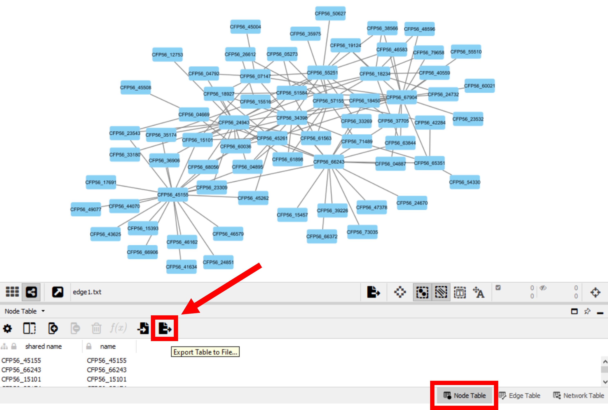

.. _task3-label:

Task 3 - Dynamic Network Visualization
======================================

DiNaR is a tool used to obtain a dynamic representation of a biological data network over multiple timepoints or different conditions. This task will guide the user on how to import and analyse networks into DiNaR.

.. raw:: html

   <iframe width="560" height="315" src="https://www.youtube.com/embed/f-mhm-MqgSU" title="YouTube video player" frameborder="0" allow="accelerometer; autoplay; clipboard-write; encrypted-media; gyroscope; picture-in-picture; web-share" allowfullscreen></iframe>

|

.. raw:: html

   <iframe width="700" height="400" src="./M2_SeasonalGrowth.html" frameborder="0" allow="accelerometer; autoplay; clipboard-write; encrypted-media; gyroscope; picture-in-picture; web-share" allowfullscreen></iframe>

|

Option 1 - Importing a Custom Network into DiNaR
------------------------------------------------

To import a custom network into `DiNaR <https://nib-si.shinyapps.io/DiNAR/>`_, a node and edge tables should be supplied following a specified tabular structure, and be firstly processed with the `DiNaR preprocessing subApp <https://nib-si.shinyapps.io/pre-processing/>`_.

Node Table Example:

.. csv-table::
   :header: "GeneID", "shortName", "shortDescription", "MapManBin"
   :widths: 10, 10, 10, 10

   "CFP56_37705", "\-", "\-", "\-"
   "CFP56_45155", "\-", "\-", "\-"
   "CFP56_55251", "\-", "\-", "\-"
   "...", "...", "...", "..."

The first column is the only one required to be filled (either with gene or protein IDs). The other columns are required but may be left empty (using "-"). Additional columns can also be present.

Edge Table Example:

.. csv-table::
   :header: "GeneID1", "GeneID2", "reactionType"
   :widths: 10, 10, 15

   "CFP56_37705", "CFP56_45155", "coexpressed_with"
   "CFP56_37705", "CFP56_55251", "coexpressed_with"
   "...", "...", "..."

Option 2 - Importing a Custom Network from Cytoscape into DiNaR
---------------------------------------------------------------

Cytoscape is a widely used tool for network analysis and visualization. This section will guide the user on how to import a Cytoscape network into DiNaR.

1. In Cytoscape, download both Network **Node** and **Edge** tables (in default .csv format).

.. figure:: images/Export_Edge_Table.png
   :scale: 20 %

2. Open the command line and run ``Cytoscape_DiNaR.R``

   .. code-block:: R

      #Inside the directory of the downloaded cork oak data (should also contain ``Cytoscape_DiNaR.R`` )
      Rscript ./Cytoscape_DiNaR_link.R -n corkoak_node.csv -c corkoak_mercator.results -o corkoak_node_ready_to_process

**Rscript Usage:**
^^^^^^^^^^^^^^^^^^

   * ``[-n] network`` - Input a Node Table (.csv, comma-separated)
   * ``[-c] custom annotation`` - Input gene/protein annotations obtained in Mercator / mercator.results (optional)
   * ``[-s] species`` - Specify a species name (e.g. quercus_suber) to retrieve annotations (if present) from the GoMapMan database (optional)
   * ``[-e] ensemblplants`` - Retrieve short names, short descriptions and orthologs from the Ensembl Plants database (optional)
   * ``[-o] output`` - Specify a name for the output network

.. warning::

   Make sure to run this script within the corkoakdata folder, otherwise specify paths to both script and input files.

After running the script, the ``corkoak_node_ready_to_process.txt`` file should have the following structure:

.. csv-table::
   :header: "GeneID", "shortName", "shortDescription", "MapManBIN"
   :widths: 10, 15, 20, 20

   "CFP56_37705", "TPX2", "protein TPX2", "1.1_XPTO1"
   "CFP56_45155", "NAC43", "NAC domain-containing protein 43", "1.2_XPTO2"
   "CFP56_55251", "COBRA4", "COBRA-like protein 4", "1.3_XPTO3"
   "...", "...", "...", "..."

3. Open the `DiNaR preprocessing subApp <https://nib-si.shinyapps.io/pre-processing/>`_ and select the **tables** option tab
4. Keeping the Tab default Separator, click **Choose Nodes File** and select ``corkoak_node_ready_to_process.txt``
5. Click **Choose Edges File** and select ``corkoak_edge_ready_to_process.txt``
6. Fill the **Type in desired network name:** with ``corkoak_processed``
7. In the Nodes Tab, click download (button under the plot visualization) and change the downloaded file name to corkoak_node_processed. It should look like the following:

.. csv-table::
   :header: "GeneID", "shortName", "shortDescription", "MapManBIN", "clusterID", "x", "y", "clusterSimplifiedNodeDegree", "expressed" 
   :widths: 10, 15, 20, 20, 10, 10, 10, 10,10

   "CFP56_37705", "TPX2", "protein TPX2", "1.1_XPTO1", "1", "x", "y", "1", "1"
   "CFP56_45155", "NAC43", "NAC domain-containing protein 43", "1.2_XPTO2", "1", "x", "y", "1", "1"
   "CFP56_55251", "COBRA4", "COBRA-like protein 4", "1.3_XPTO3", "1", "x", "y", "1", "1"
   "...", "...", "...", "...", "...", "...", "...", "...", "..."

8. In the Edges Tab, click download (button under the plot visualization), and change the downloaded file name to corkoak_edge_processed. It should look like the following:

.. csv-table::
   :header: "GeneID1", "GeneID2", "reactionType", "clusterID_geneID1", "clusterID_geneID2", "clusterSimplifiedNodeDegree_geneID1", "clusterSimplifiedNodeDegree_geneID2", "exists"
   :widths: 10, 10, 15, 10, 10, 10, 10, 10

   "CFP56_37705", "CFP56_45155", "coexpressed_with", "1", "1", "1", "1", "1"
   "CFP56_37705", "CFP56_55251", "coexpressed_with", "1", "1", "1", "1", "1"
   "...", "...", "...", "...", "...", "...", "...", "..."

**Video guide for** `DiNaR preprocessing subApp <https://nib-si.shinyapps.io/pre-processing/>`_
^^^^^^^^^^^^^^^^^^^^^^^^^^^^^^^^^^^^^^^^^^^^^^^^^^^^^^^^^^^^^^^^^^^^^^^^^^^^^^^^^^^^^^^^^^^^^^^

.. raw:: html

   <iframe width="560" height="315" src="https://www.youtube.com/embed/KWb1mpFiuOE" title="YouTube video player" frameborder="0" allow="accelerometer; autoplay; clipboard-write; encrypted-media; gyroscope; picture-in-picture; web-share" allowfullscreen></iframe>

|

Importing a Custom Network into the main DiNaR App
^^^^^^^^^^^^^^^^^^^^^^^^^^^^^^^^^^^^^^^^^^^^^^^^^^

1. Go to the `DiNaR App <https://nib-si.shinyapps.io/DiNAR/>`_
2. In **select network**, choose **Custom network**
3. In **Upload nodes table**, select the ``corkoak_node_processed`` file
4. In **Upload edges table**, select the ``corkoak_edge_processed`` file
5. In **Upload Experimental data files**, select the ``LogFC_April`` file
6. Confirm columns containing gene IDs (geneID), statistical significance (adj.P.Val) and the logFC values (LogFC_April)
7. Click **Proceed!**
8. Under the **Upload Experimental data files**, click **Browse...** and select the ``LogFC_June`` file
9. Under the **Upload Experimental data files**, click **Browse...** and select the ``LogFC_June`` file

Exploring DiNaR network visualization options
^^^^^^^^^^^^^^^^^^^^^^^^^^^^^^^^^^^^^^^^^^^^^

TODO (maybe unecessary)

Creating a dynamic network visualization
^^^^^^^^^^^^^^^^^^^^^^^^^^^^^^^^^^^^^^^^

.. note::

   Larger amounts of experimental data allows the user to create longer and richer dynamic network visualizations in Dinar.

1. Click the Differential expression per cluster Tab, and select the Dynamic-animatoR option
2. Scroll down and select a preferred video speed under the **Select speed** option
3. Click **Create dynamic.html**
4. After a couple seconds and after log text appearing on-screen, click **Download dynamic.html**

The final result should look like this:

.. raw:: html

   <iframe width="560" height="315" src="https://www.youtube.com/embed/pCWj5XBvPEg" title="YouTube video player" frameborder="0" allow="accelerometer; autoplay; clipboard-write; encrypted-media; gyroscope; picture-in-picture; web-share" allowfullscreen></iframe>

|

**Video guide for** `DiNaR App <https://nib-si.shinyapps.io/DiNAR/>`_
^^^^^^^^^^^^^^^^^^^^^^^^^^^^^^^^^^^^^^^^^^^^^^^^^^^^^^^^^^^^^^^^^^^^^

.. raw:: html

   <iframe width="560" height="315" src="https://www.youtube.com/embed/KWb1mpFiuOE" title="YouTube video player" frameborder="0" allow="accelerometer; autoplay; clipboard-write; encrypted-media; gyroscope; picture-in-picture; web-share" allowfullscreen></iframe>

|

Congratulations, this task concludes the present use-case.
Further questions or recomendations can be submitted to: `hugo.miguelr99@gmail.com <hugo.miguelr99@gmail.com>`_.